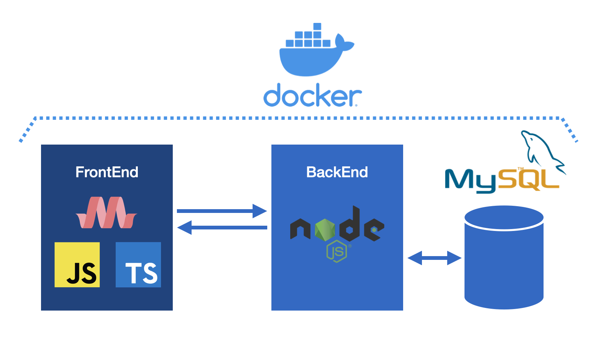
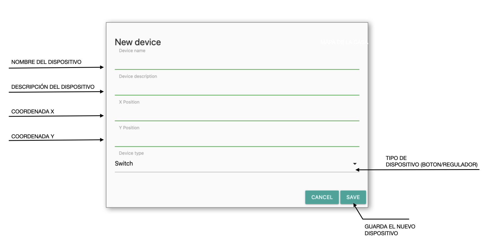
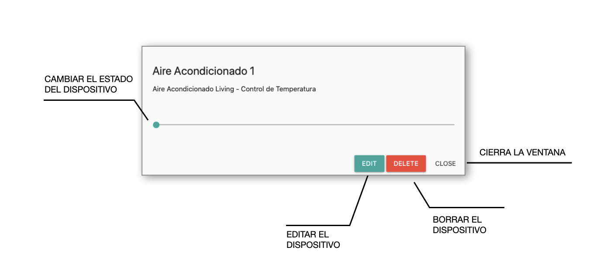
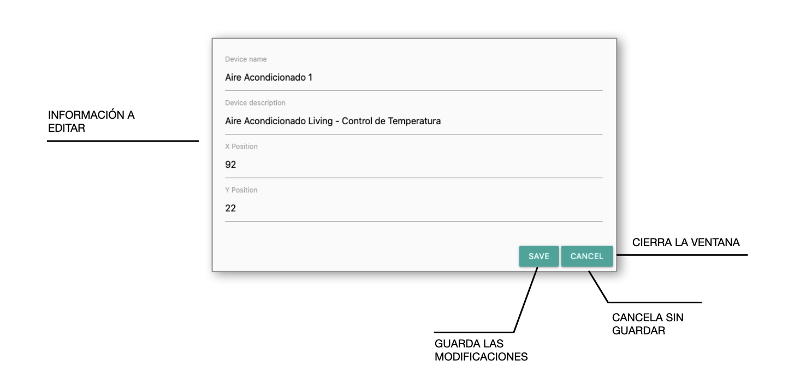

<a href="https://www.gotoiot.com/">
    
</a>

Smart Home Web App
==================

# Introducción

Este repositorio contiene una aplicación web fullstack (frontend y backend) que emula un sistema de control para dispositivos IoT hogareños. La misma funciona sobre un ecosistema `Docker`.

El frontend de la aplicación esta programado en `TypeScript` y compilado a `JavaScript` en forma automática por un deamon configurado en el `Docker`. Los estilos estan definidos utilizando el framework de diseño `Materialize`. 

<div align="center"></div>

El backend esta programado con `NodeJS` y se conecta con una `base de datos` MySQL que contiene la tabla `Devices` con la información de los dispositivos conectados a la app. 

En esta imagen se puede observar la pantalla principal de la aplicacion.


## Comenzando 🚀

Esta sección es una guía con los pasos escenciales para poder poner en marcha la aplicación.

<details><summary><b>Mira los pasos necesarios</b></summary><br>

### Instalar las dependencias

Para correr este proyecto es necesario instalar `Docker` y `Docker Compose`. 

En [este artículo](https://www.gotoiot.com/pages/articles/docker_installation_linux/) publicado en nuestra web están los detalles para instalar Docker y Docker Compose en una máquina Linux. Si desea instalar ambas herramientas en una Raspberry Pi puede seguir [este artículo](https://www.gotoiot.com/pages/articles/rpi_docker_installation) de nuestra web que te muestra todos los pasos necesarios.

En caso que quiera instalar las herramientas en otra plataforma o tenga algún incoveniente, puede leer la documentación oficial de [Docker](https://docs.docker.com/get-docker/) y también la de [Docker Compose](https://docs.docker.com/compose/install/).

Continue con la descarga del código cuando tenga las dependencias instaladas y funcionando.

### Descarga del código

Para descargar el código, lo más conveniente es que realice un `fork` de este proyecto a su cuenta personal haciendo click en [este link](https://github.com/LucianoSmith/app-fullstack-base/fork). Una vez que tenga el fork a su cuenta, descarguelo con este comando:

```
git clone https://github.com/LucianoSmith/app-fullstack-base.git
```

> En caso que no tenga una cuenta en Github puede clonar directamente este repo.

### Ejecutar la aplicación

Para ejecutar la aplicación tiene que correr el comando `docker-compose up` desde la raíz del proyecto. Este comando va a descargar las imágenes de Docker de node, de typescript, de la base datos y del admin de la DB, y luego ponerlas en funcionamiento. 

Para acceder al cliente web ingrese a a la URL [http://localhost:8000/](http://localhost:8000/) y para acceder al admin de la DB acceda a [localhost:8001/](http://localhost:8001/). 

Si pudo acceder al cliente web y al administrador significa que la aplicación se encuentra corriendo bien. 

> Si  aparece un error la primera vez que corre la app, detenga el proceso y vuelva a iniciarla. Esto es debido a que el backend espera que la DB esté creada al iniciar, y en la primera ejecución puede no alcanzar a crearse. A partir de la segunda vez el problema queda solucionado.

</details>

## Configuraciones de funcionamiento 🔩

Al crearse la aplicación se ejecutan los contenedores de Docker de cada servicio, se crea la base de datos y sus tablas. A continuación podrá encontrar info necesaria si desea cambiar la estructura de la DB o bien sus configuraciones de acceso.

>ATENCIÓN: A fin de que la aplicación se ejecute en forma correcta, no se recomienda alterar la base de datos.

<details><summary><b>Lee cómo configurar la aplicación</b></summary><br>

### Configuración de la DB

Para acceder PHPMyAdmin tiene que ingresar en la URL [localhost:8001/](http://localhost:8001/). En el login del administrador, el usuario para acceder a la db es `root` y contraseña es la variable `MYSQL_ROOT_PASSWORD` del archivo `docker-compose.yml`.

Para el caso del servicio de NodeJS que se comunica con la DB observe que en el archivo `src/backend/mysql-connector.js` están los datos de acceso para ingresar a la base.

Si desea cambiar la contraseña, puertos, hostname u otras configuraciones de la DB hay que modificar el servicio de la DB en el archivo `docker-compose.yml` y luego actualizar las configuraciones para acceder desde PHPMyAdmin y el servicio de NodeJS.

### Estructura de la DB

Al iniciar el servicio de la base de datos, si esta no está creada toma el archivo que se encuentra en `db/dumps/smart_home.sql` para crear la base de datos automáticamente.

En ese archivo está la configuración de la tabla `Devices` y otras configuraciones más. Si quiere cambiar algunas configuraciones deberá modificar este archivo y crear nuevamente la base de datos para que se tomen en cuenta los cambios.

Tenga en cuenta que la base de datos se crea con permisos de superusuario por lo que no se podrá borrar el directorio con el usuario de sistema, para eso deberá hacerlo con permisos de administrador. En ese caso puede ejecutar el comando `sudo rm -r db/data` para borrar el directorio completo.

</details>

## Detalles principales 🔍

En esta sección encontrará las características más relevantes del proyecto.

<details><summary><b>Detalles importantes de la aplicación</b></summary><br>
<br>

### Arquitectura de la aplicación

Como ya pudo observar, la aplicación se ejecuta sobre el ecosistema Docker, y en esta imagen prodrá ver el diagrama de arquitectura.


### El cliente web

El cliente web es una Single Page Application que se comunica con el servicio en NodeJS mediante JSON a través de requests HTTP. Puede consultar el estado de dispositivos en la base de datos (por medio del servicio en NodeJS) y también cambiar el estado de los mismos. Los estilos del código están basados en **Material Design**.

### El servicio web

El servicio en **NodeJS** posee distintos endpoints para comunicarse con el cliente web mediante requests HTTP enviando **JSON** y **parámetros** en cada transacción. Procesando estos requests es capaz de comunicarse con la base de datos para consultar y controlar el estado de los dispositivos, y devolverle una respuesta al cliente web también en formato JSON. Así mismo el servicio es capaz de servir el código del cliente web.
    
```
    /devices/                   # Lista toda la información de los dispositivos
    /new/                       # Crea un nuevo dispositivo con la información enviada
    /delete/:id/                # Borra el dispositivo cuyo ID ha sido enviado
    /update/                    # Actualiza un dispositivo con la información enviada
    /info/:id/                  # Muestra la informacion de un dispositivo según el ID 
```
    
### La base de datos

La base de datos se comunica con el servicio de NodeJS y permite almacenar el estado de los dispositivos en la tabla **Devices**. Ejecuta un motor **MySQL versión 5.7** y permite que la comunicación con sus clientes pueda realizarse usando usuario y contraseña en texto plano. En versiones posteriores es necesario brindar claves de acceso, por este motivo la versión 5.7 es bastante utilizada para fases de desarrollo.
### Tabla Devices
```
    id (key)        int(11)         autoincrement       # id del dispositivo
    name            varchar(64)                         # nombre corto del dispositivo
    description     varchar(128)                        # descripción del dispositivo
    state           int(11)                             # estado actual del dispositivo
    type            int(11)                             # tipo de dispositivo (0) switch / (1) slider
    posx            int(4)                              # coordenada X
    posy            int(4)                              # coordenada Y
```    
    
### El administrador de la DB
    
Para esta aplicación se usa **PHPMyAdmin**, que es un administrador de base de datos web muy utilizado y que podrá utilizar en caso que quieras realizar operaciones con la base, como crear tablas, modificar columnas, hacer consultas y otras cosas más.

### El compilador de TypeScript

**TypeScript** es un lenguaje de programación libre y de código abierto desarrollado y mantenido por Microsoft. Es un superconjunto de JavaScript, que esencialmente añade tipos estáticos y objetos basados en clases. Para esta aplicación se usa un compilador de TypeScript basado en una imagen de [Harmish](https://hub.docker.com/r/harmish) en Dockerhub, y está configurado para monitorear en tiempo real los cambios que se realizan sobre el directorio **src/frontend/ts** y automáticamente generar código compilado a JavaScript en el directorio  **src/frontend/js**. Los mensajes del compilador aparecen automáticamente en la terminal al ejecutar el comando **docker-compose up**.

### Ejecución de servicios

Los servicios de la aplicación se ejecutan sobre **contenedores de Docker**, así se pueden desplegar de igual manera en diferentes plataformas. Los detalles sobre cómo funcionan los servicios se podá ver directamente en el archivo **docker-compose.yml**.

### Organización del proyecto
    
En la siguiente ilustración se puede ver cómo está organizado el proyecto.

```sh
├── db                          # directorio de la DB
│   ├── data                    # estructura y datos de la DB
│   └── dumps                   # directorio de estructuras de la DB
│       └── smart_home.sql      # estructura con la base de datos "smart_home"
├── doc                         # documentacion general del proyecto
└── src                         # directorio codigo fuente
│   ├── backend                 # directorio para el backend de la aplicacion
│   │   ├── index.js            # codigo principal del backend
│   │   ├── mysql-connector.js  # codigo de conexion a la base de datos
│   │   ├── package.json        # configuracion de proyecto NodeJS
│   │   └── package-lock.json   # configuracion de proyecto NodeJS
│   └── frontend                # directorio para el frontend de la aplicacion
│       ├── js                  # codigo javascript que se compila automáticamente
│       ├── static              # donde alojan archivos de estilos, imagenes, fuentes, etc.
│       ├── ts                  # donde se encuentra el codigo TypeScript a desarrollar
│       └── index.html          # archivo principal del cliente HTML
├── docker-compose.yml          # archivo donde se aloja la configuracion completa
├── README.md                   # este archivo
├── CHANGELOG.md                # archivo para guardar los cambios del proyecto
├── LICENSE.md                  # licencia del proyecto
```

</details>

## Detalles de implementación 💻

En esta sección podrá ver los detalles específicos de funcionamiento del código.

<summary><b>Detalles de implementación</b></summary><br>

### Crear un dispositivo

Para crear un nuevo dispositivo haga click en el boton  o seleccione la opción `New device` del menú de opciones. Cuando aparezca la pantalla que se muestra a continuación complete la información y presione el boton `Save` para registrar el nuevo dispositivo.
    
<div align="center"></div>
    
### Listado de dispositivos

Para ver una lista de todos los dispositivos haga click en el boton  o seleccione la opción `Device lista` del menú de opciones. Deberá aparecer una ventana como la que se muestra en la siguiente figura. Tenga en cuenta que presionando el boton `View` podrá acceder a la información de un dispositivo en particular, cambiar su estado, borrarlo o editarlo.


    
### Información de un dispositivo

Para ver la información de un dispositivo en particular podra partir de la lista de dispositivos o hacer clic sobre el dispositivo buscado en el mapa de su casa. A partir de esta pantalla podrá cambiar el estado del dispositivo, borrarlo o editarlo.
    
<div align="center"></div>

### Modificar información de un dispositivo

Para editar la información de un dispositivo, vaya a la ventana de información del dispositivo y pulse el botón `Edit`. Complete la información y finalmente haga clic en `Save` para guardar los cambios.
    
<div align="center"></div>   

### Eliminar un dispositivo

Para borrar un dispositivo haga click en el boton `Delete` dentro de la ventana de información del dispositivo.
     
### Frontend

El frontend desarrollado contiene dos archivos principales: `index.html` y `main.ts`. En el archivo html se programó el diseño de la página utilizando `Materialize` y vinculando las opciones del menú (tanto para pantallas de tamaño estándar como también para pantallas mobile) a funciones programadas en el archivo `TypeScript` que es desde donde se controlan todas las funcionalidades de la aplicación.

En el archivo `main.ts` también se programó una funcion adicional (`drawDevices`) que se ejecuta al cargarse la página y, siempre que se requiera una actualización de la información. Esta función grafica sobre un mapa de la casa circulos verdes o rojos (según el estado del dispositvo) que representan los disposituvos ingresados en la app.
    
El resto de las funciones que completan la lógica de la app son `deviceList`, `deleteDevice`, `updateDevice`, `newDevice`, `changeStatus`, `validate` y `showInfo`. Toda función que requiere consulta información en la base de datos se comunica con el backend por medio de comandos `GET`, `POST` y `DELETE` según corresponda.

### Backend

El backend fue programado en el archivo `index.js` en `NodeJS` con conexión a `MySQL`. Las funciones implementadas dentro del archivo son basicamente endpoints que reciben los request del frontend y lo procesan basicamente ejecutando consultas y comandos en la base de datos.
    
<details><summary><b>Ver los endpoints disponibles</b></summary><br>

Completá todos los endpoints del backend con los metodos disponibles, los headers y body que recibe, lo que devuelve, ejemplos, etc.

1) Devolver listado completo de los dispositivos `/devices/`

```json
{
    "method": "get",
    "request_headers": "",
    "request_body": "",
    "response_code": 200,    
}
```
2) Genera un nuevo dispositivo `/new/`  
    
```json
{
    "method": "post",
    "request_headers": "Content-Type", "application/json",
    "request_body": {
            "name"          : "device_name",
            "description"   : "device_description",
            "type"          : 0,
            "state"         : 1,
            "posx"          : 50,
            "posy"          : 50,
     },
    "response_code": 200,
}
```
3) Borra en forma permanente un dispositivo `/delete/:id`

```json
{
    "method": "delete",
    "request_headers": "",
    "request_body": "",
    "request_params" : "device_id",
    "response_code": 200,
}
``` 

4) Actualiza la informacion de un dispositivo `/update/`

```json
{
    "method": "post",
    "request_headers": "Content-Type", "application/json",
    "request_body": {
            "id"            : "device_id",
            "name"          : "device_name",
            "description"   : "device_description",
            "type"          : 1,
            "state"         : 32,
            "posx"          : 60,
            "posy"          : 60
     },
    "response_code": 200,
}
```
5) Devuelve la informacion de un dispositivo `/info/`
```json
{
    "method": "get",
    "request_headers": "",
    "request_body": "",
    "request_params" : "device_id",
    "response_code": 200
}
```
    
    
</details>


## Tecnologías utilizadas 🛠️

En esta sección podrá ver las tecnologías más importantes utilizadas en este proyecto.

<details><summary><b>Lista completa de tecnologías</b></summary><br>

* [Docker](https://www.docker.com/) - Ecosistema que permite la ejecución de contenedores de software.
* [Docker Compose](https://docs.docker.com/compose/) - Herramienta que permite administrar múltiples contenedores de Docker.
* [Node JS](https://nodejs.org/es/) - Motor de ejecución de código JavaScript en backend.
* [MySQL](https://www.mysql.com/) - Base de datos para consultar y almacenar datos.
* [PHPMyAdmin](https://www.phpmyadmin.net/) - Administrador web de base de datos.
* [Material Design](https://material.io/design) - Bibliotecas de estilo responsive para aplicaciones web.
* [TypeScript](https://www.typescriptlang.org/) - Superset de JavaScript tipado y con clases.

</details>

## Contribuir 🖇️

Si está interesado en el proyecto y le gustaría sumar fuerzas para que siga creciendo y mejorando, puede abrir un hilo de discusión para charlar sus propuestas en [este link](https://github.com/gotoiot/app-fullstack-base/issues/new). Así mismo podrá leer el archivo [Contribuir.md](https://github.com/gotoiot/gotoiot-doc/wiki/Contribuir) de nuestra Wiki donde están bien explicados los pasos para que pueda enviarnos pull requests.

## Sobre Goto IoT 📖

Goto IoT es una plataforma que publica material y proyectos de código abierto bien documentados junto a una comunidad libre que colabora y promueve el conocimiento sobre IoT entre sus miembros. Acá puede ver los links más importantes:

* **[Sitio web](https://www.gotoiot.com/):** Donde se publican los artículos y proyectos sobre IoT. 
* **[Github de Goto IoT:](https://github.com/gotoiot)** Donde están alojados los proyectos para descargar y utilizar. 
* **[Comunidad de Goto IoT:](https://groups.google.com/g/gotoiot)** Donde los miembros de la comunidad intercambian información e ideas, realizan consultas, solucionan problemas y comparten novedades.
* **[Twitter de Goto IoT:](https://twitter.com/gotoiot)** Donde se publican las novedades del sitio y temas relacionados con IoT.
* **[Wiki de Goto IoT:](https://github.com/gotoiot/doc/wiki)** Donde hay información de desarrollo complementaria para ampliar el contexto.

## Muestas de agradecimiento 🎁

Si le gustó este proyecto y quisiera apoyarlo, cualquiera de estas acciones estaría más que bien para nosotros:

* Apoyar este proyecto con una ⭐ en Github para llegar a más personas.
* Sumarte a [nuestra comunidad](https://groups.google.com/g/gotoiot) abierta y dejar un feedback sobre qué le pareció el proyecto.
* [Seguirnos en twitter](https://github.com/gotoiot/doc/wiki) y dejar algún comentario o like.
* Compartir este proyecto con otras personas.

## Autores 👥

Las colaboraciones principales fueron realizadas por:

* **[Agustin Bassi](https://github.com/agustinBassi)**: Ideación, puesta en marcha y mantenimiento del proyecto.
* **[Ernesto Giggliotti](https://github.com/ernesto-g)**: Creación inicial del frontend, elección de Material Design.
* **[Brian Ducca](https://github.com/brianducca)**: Ayuda para conectar el backend a la base de datos, puesta a punto de imagen de Docker.

También puede mirar todas las personas que han participado en la [lista completa de contribuyentes](https://github.com/###/contributors).

## Licencia 📄

Este proyecto está bajo Licencia ([MIT](https://choosealicense.com/licenses/mit/)). Podés ver el archivo [LICENSE.md](LICENSE.md) para más detalles sobre el uso de este material.

---

**Copyright © Goto IoT 2021** ⌨️ [**Website**](https://www.gotoiot.com) ⌨️ [**Group**](https://groups.google.com/g/gotoiot) ⌨️ [**Github**](https://www.github.com/gotoiot) ⌨️ [**Twitter**](https://www.twitter.com/gotoiot) ⌨️ [**Wiki**](https://github.com/gotoiot/doc/wiki)
